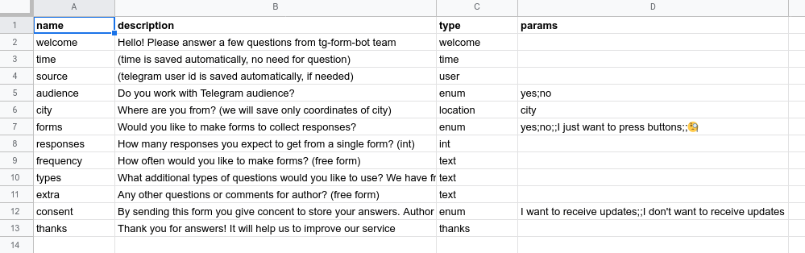
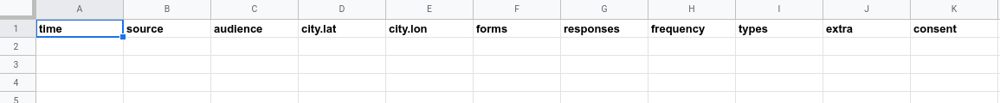

# Telegram Forms Bot - tg_forms_bot

[![Regular donation on Liberapay][liberapay-shield]][liberapay]
[![One-time donation on Buy me a coffee][buymeacoffee-shield]][buymeacoffee]
[![Chat on Matrix.org][matrix-shield]][matrix] 

[liberapay-shield]: https://img.shields.io/liberapay/receives/gltronred.svg?logo=liberapay
[liberapay]: https://liberapay.com/gltronred/donate
[buymeacoffee-shield]: https://img.shields.io/badge/buy%20me%20a%20coffee-donate-yellow
[buymeacoffee]: https://buymeacoff.ee/gltronred
[matrix-shield]: https://img.shields.io/matrix/tg-form:matrix.org
[matrix]: https://matrix.to/#/!ijqoycRMyvtVLHFCVh:matrix.org?via=matrix.org

1. Prepare a Google sheet with questions
2. Send it to the [@tg_forms_bot](https://t.me/tg_forms_bot) and start collecting responses!
3. ?????
4. PROFIT!!!

# Getting Started

1. Create a new Google spreadsheet with two sheets: `config` and `result`.
2. Fill a `config` sheet with questions ([here](https://git.sr.ht/~rd/tg-form/tree/master/docs/reference.md#config-and-result-sheets) you can find all question types).

3. Prepare a `result` sheet for responses.

4. Share the spreadsheet with a user `demo-bot-account@ozi-tg-cec.iam.gserviceaccount.com`.
5. Copy the address of your spreadsheet.
6. Start a [bot](https://t.me/tg_forms_bot). Send it a command `/newsheet
<address-of-spreadsheet>` and it will reply with a link.
7. Now you can send this link to your audience and start collecting responses.

You can fill this form yourself and leave a feedback here: https://t.me/tg_forms_bot?start=TESTFORM

# Pricing

## It's free!

However, there are limitations. There are server payments, limits on Google API
calls, programmer's man-hours of supporting and other sad things.

So your free form will be available for two weeks (this duration can be updated
if demand in forms increases), and after that you will not be able to collect
new responses. Old responses are, of course, kept in your Google sheet.

## Supporting

If you like this software and want to help me develop it, you can support me.

- If you donate a [regular donation](https://liberapay.com/gltronred/donate), I will be
able to devote more time to developing and supporting this project.
- It is well known that mathematicians and programmers use coffee as a fuel ☺
and you can [buy me a coffee](https://buymeacoff.ee/gltronred) to support my
work.

## Self-hosting

The bot works on our servers. We do our best to make this process safe and
smooth. But you can have higher requirements than we can provide.

If you want to collect responses on your server, you can self-host your own
version of the bot. Please read [the manual](https://git.sr.ht/~rd/tg-form/tree/master/docs/reference.md) on building and
deploying the bot.

Also I can consult you about self-hosting the bot, or you can hire me to deploy
it to your server. Please [contact me](#author) for details.

## Commercial license

This software is licensed under [Affero GPL v3 or any later version](LICENSE).
This means that if you use the unmodified bot on your server or if you modify
the bot you have to provide the source of the bot (or its modified version).

If use of the software under this license does not satify your organization's
legal department, we can discuss commercial licensing. Please [contact
me](#author).

# Author

If you have any other questions, please don't hesitate to contact me directly:
[@gltronred](https://t.me/gltronred) or [gltronred@pm.me](mailto:gltronred@pm.me).

You can also:
- Report bugs and submit feature requests to the [issue tracker](https://todo.sr.ht/~rd/tg-form)
- Chat with me and other users on [matrix](https://matrix.to/#/!ijqoycRMyvtVLHFCVh:matrix.org?via=matrix.org)
- Subscribe to [mailing lists](https://sr.ht/~rd/tg-form/lists) and ask any questions

You can support my work on [liberapay](https://liberapay.com/gltronred/donate)
(regular donations) or [buymeacoffee](https://buymeacoff.ee/gltronred) (one-time
donation).

